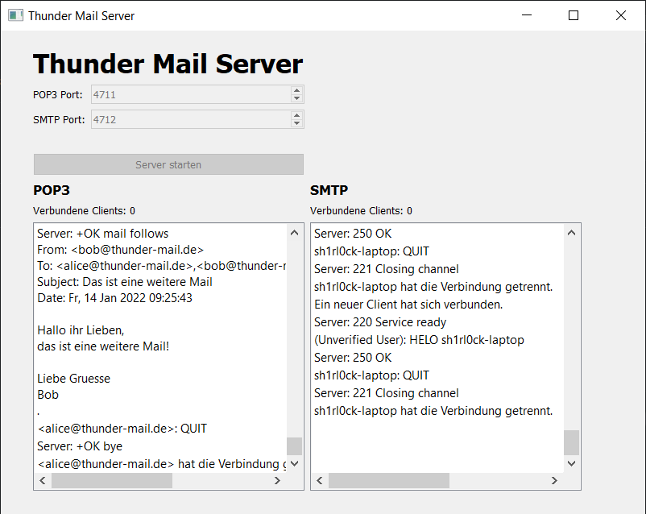

# Thunder Mail
  

Für den ITEC-Unterricht sollen wir als Projekt einen SMTP-Client und Server, sowie einen POP3-Server und Client implementieren.

## Der Server
Der Thunder Mail Server verfügt über einen POP3- und SMTP-Server, welche auf unterschiedlichen Ports laufen. Alle Benutzer und gesendeten Mails werden in einer SQLite-Datenbank gespeichert, sie sind also auch nach Beenden des Programmes verfügbar. **In der Datenbank habe ich 3 Benutzer abgelegt: alice@thunder-mail.de, bob@thunder-mail.de und philipp@thunder-mail.de. Das Passwort für alle drei lautet: "password".** 

## Der Client
Der Thunder Mail Client verfügt über drei Fenster:

### Das Anmeldefenster
Der Benutzer gibt hier die Adresse des Thunder Mail Server und die Ports für POP3 und SMTP. Außerdem gibt er Benutzername (alice@thunder-mail.de, bob@thunder-mail.de oder philipp@thunder-mail.de) und Passwort (password) an.

### Das Menüfenster
Hier kann der Benutzer alle Mails empfangen und sich den Inhalt einer Mail anzeigen (durch das Klicken auf die entsprechende Zeile in der Tabelle). Die aktuell ausgewählte Mail kann außerdem zum Löschen markiert werden. Beim Schließen des Fensters wird die Verbindung zum POP3-Server beendet und die Löschungen werden ausgeführt. Die Markierungen zum Löschen können aber auch zurückgesetzt werden.

### Das "Neue Mail verfassen"-Fenster
Hier kann der Benutzer eine neue Mail verfassen und sie abschicken.

**Planung des Projekts:**
https://app.gitkraken.com/glo/board/YZI8TmMcSQBGwWTd

